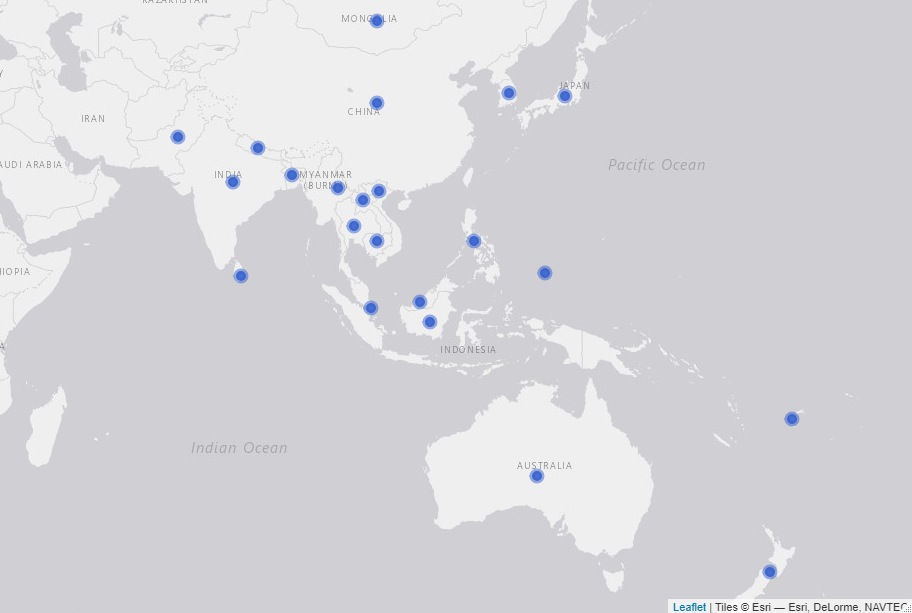

```{r setup, include=FALSE}
knitr::opts_chunk$set(echo = TRUE)
##read inicators
source("indicators.R")
#table_members = table_members

```

# Introduction

This analysis includes information of the 22 countries that are part of the Regional Cooperative Agreement for Research (RCA): `r countries_sentence`. The findings presented in this report include analysis of internal data provided by IAEA and information provided by national experts through the implementation of an online survey conducted between February to April, 2020. From the total 22 countries, `r nrow(mainqn)` participated in the online survey. The three countries that did not take part on the online survey were `r countries_not`

The map below shows all the countries that are part of this study. 

#### Map of the 22 countries that participate in the RCA programme

```{r, echo=FALSE, out.width="90%", fig.height=4}

```
\pagebreak

# Criterion 1: Increased food production

<br />

### Evidence needed for Criterion 1


#### Table X. Evidence needed for criterion 1

Evidence needed | Finding | Source 
----------------|---------|------------
Total Number of new mutant lines | `r lines_developed` | Online survey
Total Number of new mutant varieties |`r varieties_developed`  | Online survey
Average yield increase (% and tonne/Ha) | `r  yield_average` | Online survey
Total accumulated growing area (in thousand Ha) since 2000|`r total_growingArea`| Online survey
% of new mutant varieties that improve quality traits | `r perc_improvedQ` | Online survey 
Average increased income by farmers |?|?
Number of new mutant varieties adopted by policy makers | ? | ?
Number of new mutant varieties commercialised | ? | ?
<br />


### Mutant lines and mutant varieties developed under RCA since 2000

The definition used by this report for mutant lines and mutant varities is the following: **mutant lines** are what also called breeding lines. They don’t have a commercial name yet but may have qualified for the target trait that it is been bred for (mostly with breeders to be released later). They have not yet been officially released while **mutant varities** are those which have name (example Bamati or NERICA rice, ug 99 for wheat blast etc). These have been certified and officially released, and their passport data is in the public domain.

According to the responses from the online survey, **`r lines_developed` mutant lines and `r varieties_developed` mutant varieties have been developed under RCA since 2000**. As shown in the table below, from the 19 countries that participated in the online survey, two have not developed a mutant line under RCA - Bangladesh and Palau - and five have not developed a mutant variety yet - `r havent_developedVarities`-. Thus, from all the countries that participated in the online survey `r havent_lines_perc`  have not developed a mutation line and `r havent_varieties_perc` have not developed a mutation variety yet. The countries that have developed more mutant varities under the RCA programme are Japan (60), China (42), Indonesia (40), Vietnam (36), and Pakistan (35). Refer to annex 1 to see all the mutant lines and mutant varities reported by country and crop. 

**Qualitative case from Malaysia:**

```
Malaysia is an interesting case because although they do not have radiation nor field facilities, they have developed 16 mutant lines and 1 mutant variety this is possible becuase according to an internal informant from IAEA: "One of the recommendation of the RCA, is that participating countries not having an irradiation facility in their country are encouraged to use the irradiation service of the FAO/IAEA Plant Breeding and Genetics Laboratory in Seibersdorf, Austria, or arrange irradiation of their material in one of the projects participating countries having such facilities. Moreover, countries such as China, Indonesia, Japan and Vietnam are some of the countries that share thier facilities with other particiapting countries without the facility" 


```


#### Table X. Number of mutant lines and mutant varieties developed under the RCA programme since 2000 (by country)
<br/>

```{r developed, echo=FALSE}

  kable(table_developed %>%
          rename(Country = country), caption = caption_online, format = "pandoc")

```
<br/>

The figure below shows the number of mutant lines and mutant varieties developed by crop. Thus, as the table shows, more than 900 mutant lines of rice have been developed in order to produce about 120 mutant varieties of this crop; there have been more than 5,000 mutant lines of wheat to develop 45 mutant varieties. In the case of soybean, 347 mutant lines and 45 mutant varieties having developed under RCA since 2000 (See figure below).

#### Figure X. Mutant lines and mutant varieties developed by crop
```{r deveoped, echo=FALSE, fig.width=10, fig.height=6}
chart_develop

```

From the `r varieties_developed` mutant varieties developed under RCA since 2000, 145 are rice varieties, 45 wheat, and 40 soybean. The chart below presents the total number of mutant varieties developed by crop since 2000.


#### Figure X. Total mutant varieties developed by crop
```{r chart_crops, echo=FALSE, fig.width=10, fig.height=6}

chart_crops

```

### Productivity

To estimate the impact that mutant varieties have on productivity, the online survey asked the experts to report on the average yield productivity (in tonnes/ha) for the mutant and the control crops respectively. According to the responses of the experts, all the mutant varities have a higher yield productivity than their control crops. On average, the mutant varieties have `r  yield_average` higher productivity compared to the control crops. From all the reported mutant varieties crops, Bean shows the highest increase compared to its control crop (100%), followed by Sorghum with a 52.5% increase in yield productivity.

The chart below shows the average change in productivity between mutant and control crops.

*Note the graph below excludes Tomato and Banana because they have a much higher yield than the rest and including them would affect the visualization, they increased their yield 16.6% and 33.3% respectively*^[The average yield of the mutant varieties and control crops of Tomato is 35 and 30 (tonnes/ha) respectively and for Banana is 40 and 30 (tonnes/ha) respectively.]

#### Figure X. Average change in yield productivity (tonnes/ha): mutant vs control 

```{r chart_productivity, echo=FALSE, fig.width=10, fig.height=6}

chart_productivity

```

### Cumulative growing area

Approximately, **the total accumulated growing area, since 2000, of mutant crops in the 19 countries that participated in the online survey is `r total_growingArea` (in 1,000 ha)** ^[For perspective, the cumulative growing area planted with mutant crops in these 19 countries since 2000 equates to a land area nearly the size of Germany (35,738,000 ha).].  From the 14 countries with at least one mutant variety developed, Pakistan   is the country with the largest cumulative growing area of mutant crops: 16,200 (thousand ha). The second largest growing area is in China, followed by Thailand, Vietnam, and Indonesia. From the countries with at least 1 mutant variety reported, Sri Lanka and Malaysia are the ones with the smallest cumulative growing area, 0.04 and 0.2 (1,000 ha) respectively. The average cumulative growing area of mutant crops in the RCA countries is `r  prettyNum(round(mean_growingA, digits = 0), big.mark = ",")` (thousand ha). The chart below shows the total cumulative growing area of mutant varietiess since 2000 by country (eg. if a country had a growing area of 10 ha for 10 years the graph would show 100 ha).

#### Figure X. Total accumulated growing area of mutant crops since 2000 by country
```{r chart_growing, echo = F, fig.width=10, fig.height=8, warning=FALSE}
chart_growing

```


The crop with the largest accumulated growing area is Chickpea with 13,200 thousand ha and it is grown only in Pakistan, followed by Wheat (8,012 thousand ha) that is grown in China and Mongolia. The table below summarises the total mutant lines, varieties and their total growing area (in thousand ha) and yield (tonnes/ha). To see the total growing area for each crop by country, see table X in the annex.


#### Table: Cumulative Growing area and productivity of mutant crops (sorted by growing area)
```{r productivity_table, echo=FALSE}

  kable(data_crops %>%
          select(crop, lines, varieties, area, yield) %>%
          arrange(desc(area)) %>%
          filter(varieties >0) %>%
          mutate(area= prettyNum(area, big.mark = ","),
                 lines= prettyNum(lines, big.mark = ","),
                 yield = round(yield, digits = 1)) %>%
          rename(Crop = crop,
                 `Lines developed` = lines,
                 `Varieties developed` = varieties,
                 `Total cummulative growing area (1,000 ha)` = area,
                 `Average yield (tonnes/ha)` = yield
                 ), caption = caption_online)

```


### Quality traits

The number of crops for which at least one quality trait (`r quality_traits`) improved by the mutant variety was estimated  to assess whether, apart from improving the productivity of the crops, the mutant varieties contribute to an improvement in their quality or not. As a result of the online survey, it was found that `r perc_improvedQ` of the mutant varieties reported to have improved at least one quality trait. As can be seen in the figure below, from the `r number_varieties` crops for which a mutant variety has been developed, `r number_improvedQ` have improved at least one quality trait (and up to seven quality traits in the case of soybean and rice). From all the mutant varieties, only Barley and Banana have not improved any quality trait. 


#### Figure X. Number of quality traits improved by mutant varieties 

```{r chart_quality, echo = F, fig.width= 10, fig.height=7}
chart_quality

```

To check for consistency between countries on the quality traits improved, the proportion of responses that reported a positive improvement in quality crops was estimated. Thus, for each crop reported, the proportion of times the crop was reported to have improve a quality trait is presented in the figure below. 

#### Figure X. Proportion of responses reporting improvement in quality traits of mutation varieties

```{r chart_quality_check, echo = F, fig.width = 10, fig.height=7}

chart_quality_chek

```
 


# Criterion 2: Enhanced environmental protection 

### Evidence needed for Criterion 2
<br />

#### Table X. Evidence needed for criterion 2

Evidence needed                                                     |  Finding                            | Source
---------------------------------------------------------------------|-------------------------------------|------------
Weighted average reduction in chemical fertiliser use for each mutant variety |  `r w_average_pesticide`  | Online survey ^[The weighting factor was estimated by multiplying the cumulative growing area by the average yield.]
Weighted average reduction in pesticide use for each mutant variety          | `r w_average_fertilicer`   | Online survey
Weighted average increase in water use efficiency                           |  `r w_average_water`        | Online survey

### Enhanced environmental protection

To assess the environmental contribution of mutant varieties, the number of mutant crops that contribute to at least one environmental protection (`r environment_traits`)  was estimated. It was found that **all the crops for which a varietiy has been developed contribute to at least one environmental protection without a significant reduction in production**. Figure X. shows the proportion of responses, by crop, in which an enhancement in environmental protection was reported. From this figure, it can be seen that mutant varieties of Soybean, Rice, and Sorghum have contributed to a reduction of pesticide use, and chemical fertilizer, and to an improvement of soil fertility and water efficiency; mutant varieties of Tomato reduce the use of pesticides; and Mungbean, Chickpea, and Bean improve soil fertility.

#### Figure X. Proportion of responses reporting crops enhancing environmental protection. 

```{r chart_environment, echo=F, fig.width=10, fig.height=6}
chart_environment
```


### Reduction in pesticide use

Compared to the use of pesticide of the control crops, `r number_crops_pesticide` mutant crops (`r crops_pesticide`) have reduced the use of pesticide. The weighted average reduction of pesticide is `r w_average_pesticide`. Figure X below shows the reduction in the use of pesticide, compared to its control, by all the mutant varieties reported in the online survey. The vertical dotted lines mark 8% and 15% which are considered in the criterion to be good and excellent respectively. 

*Note to the team: I am exporting the report directly from R. Thus, the formatting of the text boxes isnt ideal (like the one below). However, we can format them in the final version of the report*

**Qualitative case from Phillpines:**
```
"The mutant banana and rice varieties developed and disseminated to farmers or growers are resistant to pests and diseases such that no pesticide is necessary.  In fact, there are banana growers who have 100% reduction in pesticide use but the average value should be reflected because we also considered those who use insecticide and fungicide for post-tissue culture protection of plantlets being established in the nursery  before planting out in the field.  For rice, the Philippine Department of Agriculture is promoting organic agriculture and farmers are encouraged to avoid using pesticides.  Instead, Integrated Pest Management (IPM), specifically the use of predators or beneficial insects and other arthopods, is implemented and pesticide is used as the last resort.  With mutant rice varieties that are tolerant or resistant to diseases and their vectors, there is 50% reduction in pesticide use.  The cost of pesticides in the Philippines have become prohibitive to ordinary farmers that is why majority of them could not afford to buy it and rely on IPM instead.  The latest technology to reduce pesticide use and increase rice yield is the application of radiation-modified kappa-carrageenan solution on rice plants at specific stages."

```

#### Figure X. Reduciton in the use of pesticide, compared to control crops. 

```{r chart_pesticide, echo=FALSE, fig.width=10, fig.height=7}
chart_pesticide

```

As it can be seen in the figure above, five crops have reduced, on average, the use of pesticide by 15% or more, one (Soybean) has reduced it 10% and one (Tomato) has reduced the use of pesticide 5% compared to its control crop. 

### Reduction in chemical fertiliser use

Compared to control crops, `r number_crops_fertilicer` mutant varieites (`r crops_fertilicer`) have reduced the use of chemical fertiliser. The weighted average reduction of chemical fertiliser, compared to control crops, is `r w_average_fertilicer`. Wheat, Sorghum, and Soybean have reduced, on average, about 15% the use of chemical fertiliser. The green and yellow dotted lines in the figure below mark 20% and 10% which is considered in the criterion as excellent and good respectively. 


#### Figure X. Reduction in the use of chemical fertiliser, compared to control crops. 
**QA! confirm that 35% reduction of fertilizer of Rice in Myanmar is feasible. It seems like an outlier**

```{r chart_fertiliser, echo=FALSE, fig.width=10, fig.height=7}
chart_fertiliser

```


### Increase in water efficiency

`r number_crops_water` mutant varieties (`r crops_water`) have contributed to an increase of water efficiency compared to the control crops. The weighted average increase in water efficiency by mutant varieties is `r w_average_water`. Figure X below presents the increase of water efficiency of mutant varieties in comparison with its control crops. From the figure, it can be seen that Wheat increased by 25% the efficiency in the use of water compared to the control crop, and Sorghum 15%. The vertical green and yellow lines marked 20% and 10% increase in water efficiency which, according to the criterion, represent excellent and good respectively. 

#### Figure X. Increase in water efficiency, compared to control crops. 


```{r chart_water, echo=FALSE, fig.width=10, fig.height=7}
chart_water

```


### Increase in soil fertility


`r number_crops_soil` mutant varieties (`r crops_soil`) increased soil fertility compared to their control crops. On average (weighted), mutant varieties increased `r w_average_soil`  soil fertility in comparison to control crops. Figure X below presents the increase in soil fertility of each crop in comparison to its control.

**Qualitative case from Indonesia:**

```
"In Indonesia, after soybean cultivation farmers usually give lesser amount of nitrogen fertilizer than the control (10-15 % reduction) for the next growing crop. It is because soybean root system in symbiosis with agrobacterium can uptake nitrogen from the air and deposit them in the soil so that soil fertility increases significantly."

```

#### Figure X. Increase in soil fertility, compared to control crops. 


```{r chart_soil, echo=FALSE, fig.width=10, fig.height=7}
chart_soil

```


# Criterion 3: Strengthened regional capacity and sustainability  


### Evidence needed for Criterion 3
<br />

#### Table X. Evidence needed for criterion 3

Evidence needed                       |  Finding                            | Source
--------------------------------------|------------------------------------ |---------------------------
Countries have a national team in MB                        | `r mean_national_team ` | Online survey
*Description: Training responsive to dynamic needs*         |         ?               | ?
Countries with access to field facilities                   | `r mean_field_facility` | Online Survey
Countries with access to radiation facilities               |  `r mean_radiation_facility`| Online survey
Number of group trainings in mutation breeding | `r courses_conducted`  | Internal IAEAdata
Numbers of people trained in mutation breeding and associated techniques * *(trained under RCA)* | `r people_trained` | Internal IAEAdata
Countries with trained personnel in mutation breeding |    `r countries_trained` | Internal IAEA data & online survey
Countries sharing knowledge with other countries        |  `r knowledge_total` | Online survey
Formal networks between countries and within countries        | `r institutions` | Online survey
Scientific Publications in mutation breeding produced by GPs | `r scientific_publications`  | Online survey


### National team and facilities for mutation breeding


The year in which a country started Mutation Breeding at the nationa level varies between countries. Countries like Japan, China, Sri Lanka, and India started in 1960 while countries like Laos, Cambodia or Palau started less than 15 years ago (See table below). As it can be seen in *Table X*, **`r mean_national_team `  of the 19 countries that participated in the online survey have a national team in mutation breeding**, `r mean_field_facility` have a field facility, and `r mean_radiation_facility` have a radiation facility. It is worth noting that none of the countries that started a mutation breeding program earlier than 40 years ago has a radiation facility yet. 

<br />

*QA: Check the case of Malasya, it does not have facilities but has developed varieties, is another country sharing with them*

#### Table X. Year in which mutation breeding started at the national level, human resources, and facilities by country

```{r members, echo=FALSE}
kable(table_members, caption = caption_online, format = "pandoc") 
```

<br />

### Training in mutation breeding and associated techniques

According to IAEA's internal data, since 2000, a total of `r courses_conducted` courses in mutation breeding have been conducted and **a total of `r people_trained` individuals have been trained in regional training courses under RCA projects** . Of the `r people_trained` individuals, `r women_trained` are women (`r women_trained_perc`). China is the country with the largest number of people trained with 47 trained individuals, followed by Vietnam and Indonesia with 36 people trained each. On average, `r mean_trained` people have been trained in each country under RCA projects since 2000. See table below


#### Figure X. Total people trained in regional trainings courses under RCA by country

```{r trained, echo=F, fig.width=10, fig.height=8}

chart_trained

```

To estimate the level to which RCA has contributed to the installation of human capacity in the different countries, the online survey and the internal tool were combined to analyse the number of countries for which personnel have been trained either in regional trainings or at the national level under RCA projects. In this respect, **`r countries_trained` out of the 22 countries have reported that personnel have been trained either at the national level or in regional training courses^[According to an internal informant fom IAEA: Japan and Austraila are considered as resource countries under RCA; New Zealand and Singapore have not shown much interest in mutation breeding; and Fiji is in the process of getting awreness.].** From the 22 countries only `r countries_not_trained` did not report having received training under RCA. Japan is the only country that reported to have participated in training at the national level (online survey) but not having recieved training at the regional level (internal IAEA data)


<br />


**Qualitative cases from  Mongolia, Thailand, Sri Lanka, and India**

```


Mongolia:

"The RCA projects greatly contribute to the improvement of overall skill and capacity of our breeding team on the use of nuclear and screening of technique of mutation breeding. Use of nuclear and other screening facilities among member countries is very important for developing countries which don't have sufficient facility and resources"

Thailand:

"Training support by RCA enhances the knowledge and ability of researcher, result in improving research and progress."

Sri Lanka:

"The  trainings offered by RCA for the capacity building of scientists assist them to acquire latest technologies to speed up mutation breeding.  Scientists tend to use mutagenesis to create genetic variability in many crops using the newly installed gamma irradiation chamber facilitates through IAEA. The knowledge, skills and success stories shared in the progress review meetings and TOT trainings giving encouragement to the PIs and scientists to scale up the mutation breeding programs."

India:

"Through RCA, approx 20 scientists were trained on principles of mutation breeding & advanced tools. Because of RCA, several plant breeders  are now using mutation breeding for crop improvement. The Those trained through RCA are practicing mutation breeding in crops leading to development of improved breeding lines and now conducting Training courses at national level . In last 3 years, more than 100 young scientists were trained  and we are receiving good appreciation from breeding community."


```

### Expert missions and workshops

According to IAEA's internal data, **`r expert_missions` expert missions have occured since 2000 under RCA** to which `r expert_attendees` (`r expert_women` women) national experts from from 6 countries (China, Australia, Phillipines, Pakistan, Myanmar, and India) have attended expert missions to other countries. The chart below presents the total number of national experts that have joined at least one expert mission to another country.

#### Figure X. Total number of experts that have joint missions to other countries under RCA
```{r experts, echo=F, fig.width=10, fig.height=6}

chart_experts

```

Moreover, **`r workshops` meetings/workshops for senior members in mutation breeding research** teams were facilitated. A total of `r workshop_participants` senior members have participated in these type of meetings/workshops.

<br />

**Qualitative cases from Laos and Pakistan:**

```
Laos:

"The main possitive effect of RCA in Laos is human resource development because of TC and RCA project that our breeder have had chance to learn and developed mutation breeding  Second , develop mutation breeding network that our breeder have opportunity learn from other member and send our material for irradiating because we don't have equipment for irradiating. Third we got some equipment from TC and RCA for breeding programme which helping speed up our breeding."

Pakistan:

"Agricultural institutes of Pakistan expedite the process of variety development through expertise, collaborations, trainings and infrastructure development. Access to advanced technology from other member countries and trainings for new molecular techniques helped in rapid screening of mutant lines against biotic and abiotic stresses which minimizes the cost, time and labor. Learning from experiences of member states, mutation breeding program has also been extended to new crops like seasame."

```

### Publications in mutation breeding


In the online survey, country experts were asked to report the total number of publications in mutation breeding developed in each country since 2000. By publication, the study means: journal articles, newspaper articles, theses, books (and e-books), websites, conferences, online blogs, encyclopedia articles, etc. As a result, it was reported that **a total of `r publications` publications have been developed since 2000** in the 19 countries that participated in the online survey. From these publications, `r perc_scientific` are scientific publications. Chart x below presents the total number of publications by type (scientific and non scientific) and by country since 2000. *Note to the team: This chart exludes China because the number reported of publications was very high (over 30,000)*

#### Figure X. Total number of publications developed since 2000 under RCA
```{r publications, echo=F, fig.width=10, fig.height=7}

chart_publications

```

### Networking, collaboration, and knowledge transfer

To estimate the level of collaboration between countries, the online survey asked the exeperts if their country have provided services and knowledge related to mutation breeding to other countries. Examples of services and knowledge could be: data, events, funding, infrastructure, jobs, projects, publications, research, skills shares, tools, etc. According to the answers provided by the experts, **a total of `r knowledge_total` RCA countries - `r countries_knowledge` - have provided services and knowledge related to mutation breeding to other countries**.  From these 13 countries that have shared knowledge or services with other countries, nine have shared skillshares and publications, eight have organized events, seven have shared research, and six have shared data. The table below shows the number of countries that have shared the different types of collaboration with other countries. 

#### Figure X. Number of countries that have shared knowledge or services with other countries 
```{r knowledge, echo=FALSE, fig.width=10, fig.height=7}

chart_know

```

Moreover, to estimate the level and scope of networks within the countries and to approximate the level of connection with other national stakeholders, the online survey asked the experts to provide information about the number of companies/institutions that have cooperated with the country for mutation breeding, dissemination of mutant varieties, and contribution to knowledge and the approximate number of donors that have provided funding to research projects since 2000. Survey responses indicate that approximately **`r institutions` companies/institutions have cooperated with the partner countries in the dissemination of mutant varietes and about `r funders` donors have provided funds since 2000**. As can be observed in the chart below, the level of cooperation and networking within countries varies between partners. From the 19 countries, only three - Cambodia, Myanmar, and Palau - did not report any relationship with other institutions or donors within their countries. For the other partners who have established cooperation with other national organizations, China and South Korea are the ones with a larger network of collaboration with other institutions, 100 and 80 respectively. As for the number of donors who have provided funding for research projects, since 2000, China, Pakistan, and India have reported 20, 15, and 10 fundings from donors respectively. From the countries that reported a collaboration with either a donor or an insitution, only Thailand have not received funding from any donors. 

#### Figure X. Number of institutions and donors that have cooperated for mutation breeding by country


```{r partners, echo=FALSE, fig.width=10, fig.height=7}

chart_partners

```


# Annex 1

### Mutant lines and mutant varities developed (by country and crop)


```{r crops, echo=FALSE, fig.width=10, fig.height=7}

kable(table_crops_annex,caption = caption_online, format = "pandoc") 

```