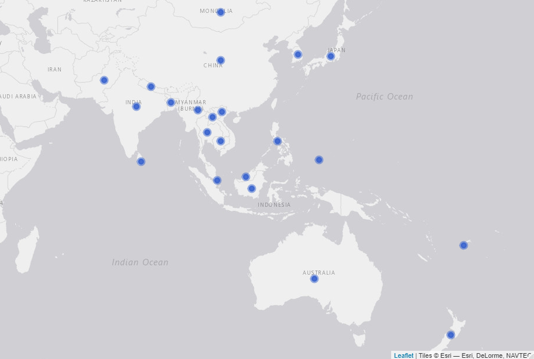

# Introduction

This analysis includes information of the 22 countries that are part of the Regional Cooperative Agreement for Research (RCA): Australia, Bangladesh, Cambodia, China, Fiji, India, Indonesia, Japan, Laos, Malaysia, Mongolia, Myanmar, Nepal, New Zealand, Pakistan, Palau, Philippines, Singapore, South Korea, Sri Lanka, Thailand, and Vietnam. The findings presented in this report include analysis of internal data provided by IAEA and information provided by national experts through the implementation of an online survey conducted between February to April, 2020. From the total 22 countries, 19 participated in the online survey. The three countries that did not take part on the online survey were Fiji, New Zealand, and Singapore

The map below shows all the countries that are part of this study. 

#### Map of the 22 countries that participate in the RCA programme

{width=90%}
\pagebreak

# Criterion 1: Increased food production

 

### Evidence needed for Criterion 1

#### Table X. Evidence needed for criterion 1

Evidence needed | Finding | Source 
----------------|---------|------------
Total Number of new mutant lines | 7,316 | Online survey
Total Number of new mutant varieties |254  | Online survey
Average yield increase (% and tonne/Ha) | 32.3% | Online survey
Total accumulated growing area (in thousand Ha) since 2000|38,826| Online survey
% of new mutant varieties that improve quality traits | 100% | Online survey 
Average increased income by farmers |?|?
Number of new mutant varieties adopted by policy makers | ? | ?
Number of new mutant varieties commercialised | ? | ?
 

### Mutant lines and mutant varieties developed under RCA since 2000

The definition used by this report for mutant lines and mutant varities is the following: **mutant lines** are what also called breeding lines. They don’t have a commercial name yet but may have qualified for the target trait that it is been bred for (mostly with breeders to be released later). They have not yet been officially released while **mutant varities** are those which have name (example Bamati or NERICA rice, ug 99 for wheat blast etc). These have been certified and officially released, and their passport data is in the public domain.

According to the responses from the online survey, **7,316 mutant lines and 254 mutant varieties have been developed under RCA since 2000**. As shown in the table below, from the 19 countries that participated in the online survey, two have not developed a mutant line under RCA - Bangladesh and Palau - and five have not developed a mutant variety yet - Bangladesh, Cambodia, Laos, Nepal, and Palau-. Thus, from all the countries that participated in the online survey 11%  have not developed a mutation line and 26% have not developed a mutation variety yet. The countries that have developed more mutant varities under the RCA programme are Japan (60), China (42), Indonesia (40), Vietnam (36), and Pakistan (35). Refer to annex 1 to see all the mutant lines and mutant varities reported by country and crop. 

#### Table X. Number of mutant lines and mutant varieties developed under the RCA programme since 2000 (by country)
 

Table: Source: IAEA's online survey, 2020

Country       Has developed lines    Lines developed  Has developed varieties    Varieties developed
------------  --------------------  ----------------  ------------------------  --------------------
Australia     Yes                                150  Yes                                          1
Bangladesh    No                                   0  No                                           0
Cambodia      Yes                                  1  No                                           0
China         Yes                               5000  Yes                                         42
India         Yes                                 65  Yes                                          7
Indonesia     Yes                                450  Yes                                         40
Japan         Yes                                 60  Yes                                         60
Laos          Yes                                 93  No                                           0
Malaysia      Yes                                 16  Yes                                          1
Mongolia      Yes                                 20  Yes                                          3
Myanmar       Yes                                 35  Yes                                          5
Nepal         Yes                                 50  No                                           0
Pakistan      Yes                                173  Yes                                         35
Palau         No                                   0  No                                           0
Philippines   Yes                                 34  Yes                                          7
South Korea   Yes                                800  Yes                                          7
Sri Lanka     Yes                                 19  Yes                                          1
Thailand      Yes                                100  Yes                                          9
Vietnam       Yes                                250  Yes                                         36
 

The figure below shows the number of mutant lines and mutant varieties developed by crop. Thus, as the table shows, more than 900 mutant lines of rice have been developed in order to produce about 120 mutant varieties of this crop; there have been more than 5,000 mutant lines of wheat to develop 45 mutant varieties. In the case of soybean, 347 mutant lines and 45 mutant varieties having developed under RCA since 2000 (See figure below).

#### Figure X. Mutant lines and mutant varieties developed by crop
<!-- -->

From the 254 mutant varieties developed under RCA since 2000, 145 are rice varieties, 45 wheat, and 40 soybean. The chart below presents the total number of mutant varieties developed by crop since 2000.

#### Figure X. Total mutant varieties developed by crop
<!-- -->

### Productivity

To estimate the impact that mutant varieties have on productivity, the online survey asked the experts to report on the average yield productivity (in tonnes/ha) for the mutant and the control crops respectively. According to the responses of the experts, all the mutant varities have a higher yield productivity than their control crops. On average, the mutant varieties have 32.3% higher productivity compared to the control crops. From all the reported mutant varieties crops, Bean shows the highest increase compared to its control crop (100%), followed by Sorghum with a 52.5% increase in yield productivity.

The chart below shows the average change in productivity between mutant and control crops.

*Note the graph below excludes Tomato and Banana because they have a much higher yield than the rest and including them would affect the visualization, they increased their yield 16.6% and 33.3% respectively*^[The average yield of the mutant varieties and control crops of Tomato is 35 and 30 (tonnes/ha) respectively and for Banana is 40 and 30 (tonnes/ha) respectively.]

#### Figure X. Average change in yield productivity (tonnes/ha): mutant vs control 

<!-- -->

### Cumulative growing area

Approximately, **the total accumulated growing area, since 2000, of mutant crops in the 19 countries that participated in the online survey is 38,826 (in 1,000 ha)** ^[For perspective, the cumulative growing area planted with mutant crops in these 19 countries since 2000 equates to a land area nearly the size of Germany (35,738,000 ha).].  From the 14 countries with at least one mutant variety developed, Pakistan   is the country with the largest cumulative growing area of mutant crops: 16,200 (thousand ha). The second largest growing area is in China, followed by Thailand, Vietnam, and Indonesia. From the countries with at least 1 mutant variety reported, Sri Lanka and Malaysia are the ones with the smallest cumulative growing area, 0.04 and 0.2 (1,000 ha) respectively. The average cumulative growing area of mutant crops in the RCA countries is 2,773 (thousand ha). The chart below shows the total cumulative growing area of mutant varietiess since 2000 by country (eg. if a country had a growing area of 10 ha for 10 years the graph would show 100 ha).

#### Figure X. Total accumulated growing area of mutant crops since 2000 by country
<!-- -->

The crop with the largest accumulated growing area is Chickpea with 13,200 thousand ha and it is grown only in Pakistan, followed by Wheat (8,012 thousand ha) that is grown in China and Mongolia. The table below summarises the total mutant lines, varieties and their total growing area (in thousand ha) and yield (tonnes/ha). To see the total growing area for each crop by country, see table X in the annex.

#### Table: Cumulative Growing area and productivity of mutant crops (sorted by growing area)

Table: Source: IAEA's online survey, 2020

Crop        Lines developed    Varieties developed  Total cummulative growing area (1,000 ha)    Average yield (tonnes/ha)
----------  ----------------  --------------------  ------------------------------------------  --------------------------
Chickpea    55                                  15  13,200                                                             1.5
Rice        973                                122  9,575                                                              5.9
Wheat       5,165                               45  8,012                                                              4.0
Mungbean    178                                 19  4,380                                                              1.3
Soybean     347                                 40  1,929                                                              2.0
Barley      84                                   1  1,000                                                              2.1
Blackgram   15                                   2  600                                                                1.5
Sorghum     150                                  3  120                                                                6.1
Groundnut   25                                   2  10                                                                 3.0
Banana      7                                    1  0.1                                                               40.0
Bean        216                                  3  0.05                                                               2.0
Tomato      2                                    1  0.035                                                             35.0

### Quality traits

The number of crops for which at least one quality trait (gluten free, grain size, grain shape, grain color, milling quality, eating quality, high mineral content, high oil content, and high seed protein content) improved by the mutant variety was estimated  to assess whether, apart from improving the productivity of the crops, the mutant varieties contribute to an improvement in their quality or not. As a result of the online survey, it was found that 100% of the mutant varieties reported to have improved at least one quality trait. As can be seen in the figure below, from the 10 crops for which a mutant variety has been developed, 10 have improved at least one quality trait (and up to seven quality traits in the case of soybean and rice). From all the mutant varieties, only Barley and Banana have not improved any quality trait. 

#### Figure X. Number of quality traits improved by mutant varieties 

<!-- -->

To check for consistency between countries on the quality traits improved, the proportion of responses that reported a positive improvement in quality crops was estimated. Thus, for each crop reported, the proportion of times the crop was reported to have improve a quality trait is presented in the figure below. 

#### Figure X. Proportion of responses reporting improvement in quality traits of mutation varieties

<!-- -->
 

# Criterion 2: Enhanced environmental protection 

### Evidence needed for Criterion 2
 

#### Table X. Evidence needed for criterion 2

Evidence needed                                                     |  Finding                            | Source
---------------------------------------------------------------------|-------------------------------------|------------
Weighted average reduction in chemical fertiliser use for each mutant variety |  21%  | Online survey ^[The weighting factor was estimated by multiplying the cumulative growing area by the average yield.]
Weighted average reduction in pesticide use for each mutant variety          | 17%   | Online survey
Weighted average increase in water use efficiency                           |  12%        | Online survey

### Enhanced environmental protection

To assess the environmental contribution of mutant varieties, the number of mutant crops that contribute to at least one environmental protection (reduction of pesticide use, reduction of chemical fertilizer, increase of water efficiency, or increase soil fertility)  was estimated. It was found that **all the crops for which a varietiy has been developed contribute to at least one environmental protection without a significant reduction in production**. Figure X. shows the proportion of responses, by crop, in which an enhancement in environmental protection was reported. From this figure, it can be seen that mutant varieties of Soybean, Rice, and Sorghum have contributed to a reduction of pesticide use, and chemical fertilizer, and to an improvement of soil fertility and water efficiency; mutant varieties of Tomato reduce the use of pesticides; and Mungbean, Chickpea, and Bean improve soil fertility.

#### Figure X. Proportion of responses reporting crops enhancing environmental protection. 

<!-- -->

### Reduction in pesticide use

Compared to the use of pesticide of the control crops, seven mutant crops (Banana, Barley, Rice, Sorghum, Soybean, Tomato, and Wheat) have reduced the use of pesticide. The weighted average reduction of pesticide is 21%. Figure X below shows the reduction in the use of pesticide, compared to its control, by all the mutant varieties reported in the online survey. The vertical dotted lines mark 8% and 15% which are considered in the criterion to be good and excellent respectively. 

**QA! check with Sinh that 80% reduction of Banana is likely and the reduction of pesticide of Rice in Phillipines (50%) which is a clear outlayer**

#### Figure X. Reduciton in the use of pesticide, compared to control crops. 

<!-- -->

As it can be seen in the figure above, five crops have reduced, on average, the use of pesticide by 15% or more, one (Soybean) has reduced it 10% and one (Tomato) has reduced the use of pesticide 5% compared to its control crop. 

### Reduction in chemical fertiliser use

Compared to control crops, four mutant varieites (Rice, Sorghum, Soybean, and Wheat) have reduced the use of chemical fertiliser. The weighted average reduction of chemical fertiliser, compared to control crops, is 17%. Wheat, Sorghum, and Soybean have reduced, on average, about 15% the use of chemical fertiliser. The green and yellow dotted lines in the figure below mark 20% and 10% which is considered in the criterion as excellent and good respectively. 

\begin{Form}
    \TextField[width = 10cm,%
               height = 3cm,%
               multiline=true,%
               bordercolor = 0 0 0.5,%
               backgroundcolor = 0 0 0.5,%
               color = 1 1 1,%
               value = {%
                          This is the textbox.
                          I would like a dark blue textbox with white writing
                        }%
               ]{}
\end{Form}

#### Figure X. Reduction in the use of chemical fertiliser, compared to control crops. 
**QA! confirm that 35% reduction of fertilizer of Rice in Myanmar is feasible. It seems like an outlier**

<!-- -->

### Increase in water efficiency

Four mutant varieties (Rice, Sorghum, Soybean, and Wheat) have contributed to an increase of water efficiency compared to the control crops. The weighted average increase in water efficiency by mutant varieties is 12%. Figure X below presents the increase of water efficiency of mutant varieties in comparison with its control crops. From the figure, it can be seen that Wheat increased by 25% the efficiency in the use of water compared to the control crop, and Sorghum 15%. The vertical green and yellow lines marked 20% and 10% increase in water efficiency which, according to the criterion, represent excellent and good respectively. 

#### Figure X. Increase in water efficiency, compared to control crops. 

**QA! check if Rice improvement of water efficiency in Japan is 1 or 10%. Same with soybean**

<!-- -->

### Increase in soil fertility

Six mutant varieties (Bean, Chickpea, Mungbean, Rice, Sorghum, and Soybean ^[In Indonesia, after soybean cultivation farmers usually give lesser amount of nitrogen fertilizer than the control (10-15 % reduction) for the next growing crop. It is because soybean root system in symbiosis with agrobacterium can uptake nitrogen from the air and deposit them in the soil so that soil fertility increases significantly.]) increased soil fertility compared to their control crops. On average (weighted), mutant varieties increased 8%  soil fertility in comparison to control crops. Figure X below presents the increase in soil fertility of each crop in comparison to its control

#### Figure X. Increase in soil fertility, compared to control crops. 

**QA! check the increase of soil efficiency of soybean, it varies a lot between countries**
<!-- -->

# Criterion 3: Strengthened regional capacity and sustainability  

*Write a description of criterion 3 and its relation to the ToC*

### Evidence needed for Criterion 3
 

#### Table X. Evidence needed for criterion 3

Evidence needed                       |  Finding                            | Source
--------------------------------------|------------------------------------ |---------------------------
Countries have a national team in MB                        | 73.7% | Online survey
*Description: Training responsive to dynamic needs*         |         ?               | ?
Countries with access to field facilities                   | 89.5% | Online Survey
Countries with access to radiation facilities               |  68.4%| Online survey
Number of group trainings in mutation breeding | 25  | Internal IAEAdata
Numbers of people trained in mutation breeding and associated techniques * *(trained under RCA)* | 470 | Internal IAEAdata
Countries with trained personnel in mutation breeding |    19 | Internal IAEA data & online survey
Countries sharing knowledge with other countries        |  13 | Online survey
Formal networks between countries and within countries        | 493 | Online survey
Scientific Publications in mutation breeding produced by GPs | 977  | Online survey

### National team and facilities for mutation breeding

The year in which a country started Mutation Breeding at the nationa level varies between countries. Countries like Japan, China, Sri Lanka, and India started in 1960 while countries like Laos, Cambodia or Palau started less than 15 years ago (See table below). As it can be seen in *Table X*, **73.7%  of the 19 countries that participated in the online survey have a national team in mutation breeding**, 89.5% have a field facility, and 68.4% have a radiation facility. It is worth noting that none of the countries that started a mutation breeding program earlier than 40 years ago has a radiation facility yet. 

 

*QA: Check the case of Malasya, it does not have facilities but has developed varieties, is another country sharing with them*

#### Table X. Year in which mutation breeding started at the national level, human resources, and facilities by country

Table: Source: IAEA's online survey, 2020

Country        Year mutation breeding started at the national level   Total years  National team   Field facility   Radiation facility 
------------  -----------------------------------------------------  ------------  --------------  ---------------  -------------------
Japan                                                          1960            60  Yes             No               Yes                
China                                                          1960            60  Yes             Yes              Yes                
Sri Lanka                                                      1960            60  Yes             Yes              Yes                
India                                                          1960            60  Yes             Yes              Yes                
South Korea                                                    1960            60  Yes             Yes              Yes                
Philippines                                                    1962            58  Yes             Yes              Yes                
Thailand                                                       1965            55  Yes             Yes              Yes                
Pakistan                                                       1970            50  Yes             Yes              Yes                
Myanmar                                                        1970            50  Yes             Yes              Yes                
Australia                                                      1971            49  No              Yes              Yes                
Bangladesh                                                     1972            48  Yes             Yes              Yes                
Indonesia                                                      1972            48  Yes             Yes              Yes                
Malaysia                                                       1975            45  No              No               No                 
Vietnam                                                        1978            42  Yes             Yes              Yes                
Mongolia                                                       1982            38  Yes             Yes              No                 
Nepal                                                          1997            23  No              Yes              No                 
Palau                                                          2009            11  No              Yes              No                 
Laos                                                           2015             5  Yes             Yes              No                 
Cambodia                                                       2018             2  No              Yes              No                 

 

### Training in mutation breeding and associated techniques

According to IAEA's internal data, since 2000, a total of 25 courses in mutation breeding have been conducted and **a total of 470 individuals have been trained in regional training courses under RCA projects** . Of the 470 individuals, 108 are women (23%). China is the country with the largest number of people trained with 47 trained individuals, followed by Vietnam and Indonesia with 36 people trained each. On average, 21 people have been trained in each country under RCA projects since 2000. See table below

#### Figure X. Total people trained in regional trainings courses under RCA by country

<!-- -->

To estimate the level to which RCA has contributed to the installation of human capacity in the different countries, the online survey and the internal tool were combined to analyse the number of countries for which personnel have been trained either in regional trainings or at the national level under RCA projects. In this respect, **19 out of the 22 countries have reported that personnel have been trained either at the national level or in regional training courses**. From the 22 countries only Australia, Fiji, and Singapore did not report having received training under RCA. Japan is the only country that reported to have participated in training at the national level (online survey) but not having recieved training at the regional level (internal IAEA data)

**To discuss with the team: Rubric says all countries should “have some trained personnel in mutation breeding” (Might not be the same as the “total people trained under RCA by country” because for example Australia said zero but probably they already have trained personnel)**

 

### Expert missions and workshops

According to IAEA's internal data, **26 expert missions have occured since 2000 under RCA** to which 22 (5% women) national experts from from 6 countries (China, Australia, Phillipines, Pakistan, Myanmar, and India) have attended expert missions to other countries. The chart below presents the total number of national experts that have joined at least one expert mission to another country.

#### Figure X. Total number of experts that have joint missions to other countries under RCA
<!-- -->

Moreover, **23 meetings/workshops for senior members in mutation breeding research** teams were facilitated. A total of 453 senior members have participated in these type of meetings/workshops.

 

### Publications in mutation breeding
**QA!: Confirm that the number of reported publications of China is correct. China reported over 30,000)**

In the online survey, country experts were asked to report the total number of publications in mutation breeding developed in each country since 2000. By publication, the study means: journal articles, newspaper articles, theses, books (and e-books), websites, conferences, online blogs, encyclopedia articles, etc. As a result, it was reported that **a total of 1,801 publications have been developed since 2000** in the 19 countries that participated in the online survey. From these publications, 54.2% are scientific publications. Chart x below presents the total number of publications by type (scientific and non scientific) and by country since 2000. *Note to the team: This chart exludes China because the number reported of publications was very high (over 30,000)*

#### Figure X. Total number of publications developed since 2000 under RCA
<!-- -->

### Networking, collaboration, and knowledge transfer

To estimate the level of collaboration between countries, the online survey asked the exeperts if their country have provided services and knowledge related to mutation breeding to other countries. Examples of services and knowledge could be: data, events, funding, infrastructure, jobs, projects, publications, research, skills shares, tools, etc. According to the answers provided by the experts, **a total of 13 RCA countries - Japan, Pakistan, Bangladesh, China, Indonesia, Thailand, Sri Lanka, India, Vietnam, Malaysia, Australia, Philippines, and South Korea - have provided services and knowledge related to mutation breeding to other countries**.  From these 13 countries that have shared knowledge or services with other countries, nine have shared skillshares and publications, eight have organized events, seven have shared research, and six have shared data. The table below shows the number of countries that have shared the different types of collaboration with other countries. 

#### Figure X. Number of countries that have shared knowledge or services with other countries 
<!-- -->

Moreover, to estimate the level and scope of networks within the countries and to approximate the level of connection with other national stakeholders, the online survey asked the experts to provide information about the number of companies/institutions that have cooperated with the country for mutation breeding, dissemination of mutant varieties, and contribution to knowledge and the approximate number of donors that have provided funding to research projects since 2000. Survey responses indicate that approximately **493 companies/institutions have cooperated with the partner countries in the dissemination of mutant varietes and about 85 donors have provided funds since 2000**. As can be observed in the chart below, the level of cooperation and networking within countries varies between partners. From the 19 countries, only three - Cambodia, Myanmar, and Palau - did not report any relationship with other institutions or donors within their countries. For the other partners who have established cooperation with other national organizations, Bangladesh and China are the ones with a larger network of collaboration with other institutions, 150 and 100 respectively. As for the number of donors who have provided funding for research projects, since 2000, China, Pakistan, and India have reported 20, 15, and 10 fundings from donors respectively. From the countries that reported a collaboration with either a donor or an insitution, only Thailand have not received funding from any donors. 

#### Figure X. Number of institutions and donors that have cooperated for mutation breeding by country

*QA!check the Bangladesh figure with Sinh*

<!-- -->

# Annex 1

### Mutant lines and mutant varities developed (by country and crop)

Table: Source: IAEA's online survey, 2020

Country       Crop        Lines developed    Varities developed  Cumulative Growing area (in thousand ha)    Yield (tonnes/ha)   Yield Control (tonnes/ha)
------------  ----------  ----------------  -------------------  -----------------------------------------  ------------------  --------------------------
Australia     Barley      80                                  1  1,000                                                     2.1                        2.00
Australia     Lupin       8                                   0  NA                                                         NA                          NA
Australia     Oat         12                                  0  NA                                                         NA                          NA
Australia     Wheat       50                                  0  NA                                                         NA                          NA
Bangladesh    Groundnut   0                                   0  NA                                                         NA                          NA
Bangladesh    Rice        0                                   0  NA                                                         NA                          NA
Bangladesh    Sugarcane   0                                   0  NA                                                         NA                          NA
Cambodia      Banana      0                                   0  NA                                                         NA                          NA
Cambodia      Maize       0                                   0  NA                                                         NA                          NA
Cambodia      Rice        1                                   0  NA                                                         NA                          NA
China         Wheat       5,000                              42  8,000                                                     6.5                        5.00
India         Blackgram   15                                  2  600                                                       1.5                        1.00
India         Groundnut   20                                  2  10                                                        3.0                        2.00
India         Mungbean    30                                  3  400                                                       1.5                        1.00
Indonesia     Rice        200                                25  1,050                                                     7.5                        5.00
Indonesia     Sorghum     100                                 3  120                                                       6.1                        4.00
Indonesia     Soybean     150                                12  800                                                       2.4                        1.00
Japan         Rice        43                                 43  180.2                                                     5.0                        5.00
Japan         Soybean     17                                 17  13                                                        1.7                        1.70
Laos          Mungbean    10                                  0  NA                                                         NA                          NA
Laos          Rice        63                                  0  NA                                                         NA                          NA
Laos          Soybean     20                                  0  NA                                                         NA                          NA
Malaysia      Banana      3                                   0  NA                                                         NA                          NA
Malaysia      Pineapple   3                                   0  NA                                                         NA                          NA
Malaysia      Rice        10                                  1  0.2                                                      10.0                        5.00
Mongolia      Barley      4                                   0  NA                                                         NA                          NA
Mongolia      Rice        1                                   0  NA                                                         NA                          NA
Mongolia      Wheat       15                                  3  12                                                        1.6                        1.00
Myanmar       Mungbean    9                                   0  NA                                                         NA                          NA
Myanmar       Rice        26                                  5  100                                                       4.5                        3.00
Myanmar       Sesame      0                                   0  NA                                                         NA                          NA
Nepal         Groundnut   5                                   0  NA                                                         NA                          NA
Nepal         Rice        20                                  0  NA                                                         NA                          NA
Nepal         Sugarcane   25                                  0  NA                                                         NA                          NA
Pakistan      Chickpea    55                                 15  13,200                                                    1.5                        1.00
Pakistan      Mungbean    88                                 12  2,280                                                     1.3                        1.00
Pakistan      Rice        30                                  8  6,000                                                     5.5                        4.00
Palau         Banana      0                                   0  NA                                                         NA                          NA
Palau         Groundnut   0                                   0  NA                                                         NA                          NA
Palau         Pineapple   0                                   0  NA                                                         NA                          NA
Philippines   Adlai       1                                   0  NA                                                         NA                          NA
Philippines   Banana      4                                   1  0.1                                                      40.0                       30.00
Philippines   Rice        29                                  6  0.146                                                     3.0                        3.00
Philippines   Sugarcane   0                                   0  NA                                                         NA                          NA
South Korea   Bean        200                                 3  0.05                                                      2.0                        2.00
South Korea   Oat         50                                  0  NA                                                         NA                          NA
South Korea   Rice        400                                 4  10                                                        5.0                        4.75
South Korea   Sorghum     50                                  0  NA                                                         NA                          NA
South Korea   Wheat       100                                 0  NA                                                         NA                          NA
Sri Lanka     Bean        16                                  0  NA                                                         NA                          NA
Sri Lanka     Mungbean    1                                   0  NA                                                         NA                          NA
Sri Lanka     Tomato      2                                   1  0.035                                                    35.0                       30.00
Thailand      Mungbean    40                                  4  1,700                                                     1.0                        1.00
Thailand      Soybean     60                                  5  960                                                       1.7                        1.00
Vietnam       Rice        150                                30  2,235                                                     6.5                        6.00
Vietnam       Soybean     100                                 6  156                                                       2.0                        2.00
